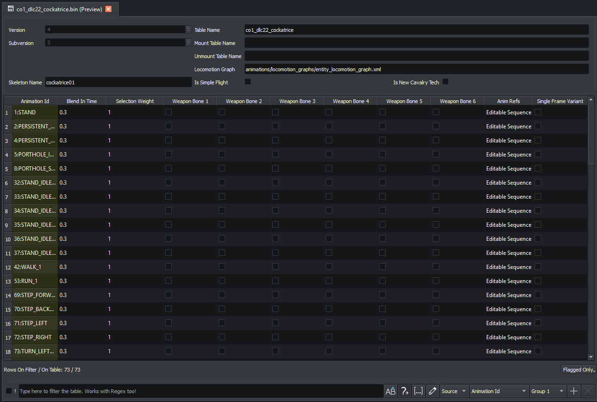

# Animations

Three closely related animation file types share a chapter but each have different UI maturity in RPFM today: **AnimsTable**, **AnimFragmentBattle**, and **MatchedCombat**.

> If you're new to TW animation modding, the practical order is: AnimsTable defines the animation library; AnimFragmentBattle says how those animations apply to a creature in battle; MatchedCombat orchestrates the synchronised "two units fighting each other" animations.

## AnimsTable

UI is a **JSON debug view**: the file decodes via the lib, gets serialised to pretty JSON in a text editor, and saving parses the JSON back into the structured form. Round-trip works, but there is no row-grid UI yet — you edit JSON.

<!-- IMAGE: AnimsTable open as a JSON text editor. -->

## AnimFragmentBattle

A proper structured editor — the only one of the three that has a custom UI. The view exposes the fragment's metadata (skeleton name, locomotion graphs, identity flags) as form widgets, and the per-entry table as an embedded grid.

[Diagnostics](../search/diagnostics.md) for AnimFragmentBattle catch:

- Missing locomotion graph references.
- Missing referenced animation files.
- Missing sound files.

## MatchedCombat

UI is a **JSON debug view**, same model as AnimsTable. The lib has different decode paths per game (Three Kingdoms, Warhammer 3, and a default for the rest) so the JSON shape varies, but the editor is the same generic JSON editor.

<!-- IMAGE: MatchedCombat open as a JSON text editor. -->

## Anim & legacy formats

`.anim` files (the raw animation streams the others reference) currently have **no UI viewer at all** in RPFM. The lib has read support so they're decodable programmatically, but double-clicking one in the tree will not open it.
