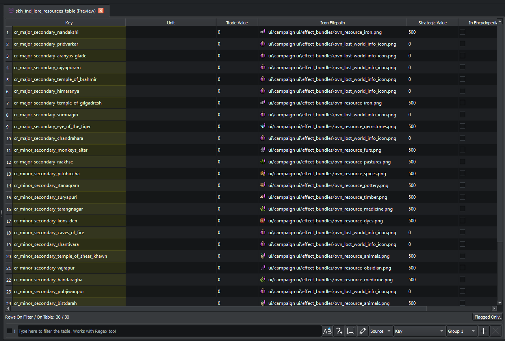

# DB tables

The DB editor is the heart of RPFM. Every Total War mod that changes unit stats, tech effects, building chains, faction colours, ability cooldowns or hundreds of other things does it by editing rows in a DB table.

## What's a DB table?

A binary file under `db/<table_name>_tables/<file_name>` inside a Pack. Each table has a schema-defined set of typed columns and a list of rows. RPFM resolves the schema for the active game on load, decodes the rows, and presents them as a grid you can edit like a spreadsheet.

## Layout

The editor itself is just the **grid** plus a small **status bar** at the bottom (line counter, flagged-rows filter button). There is no top toolbar — every action lives in the grid's right-click **context menu**, plus a couple of pop-up panels:

- **Filter bar** at the bottom of the grid, with **Use Regex** and **Case Sensitive** toggles and a column-group selector. Filter matches across the selected column group.
- **Search panel** (`Ctrl+F`) — a pop-up find/replace bar over the grid; column-aware. For project-wide replace use [Global Search](../search/global-search.md).
- **Sidebar panel** — a per-column hide / freeze checkbox grid. Open it from the right-click menu's **Sidebar** entry. Frozen columns stay pinned to the left of the grid as you scroll.

The grid's vertical header (row numbers) is always visible; the horizontal header is visible by default but column visibility/freezing is driven from the **Sidebar** panel rather than from a header right-click menu.

## Right-click context menu

Right-click anywhere in the grid for the full action set. Highlights:

- **Add Row** / **Insert Row** / **Delete Row** / **Delete Filtered-Out Rows**
- **Clone ▸ Clone & Insert Row** / **Clone & Append Row**
- **Copy ▸ Copy** / **Copy as LUA Table** / **Copy to Filter Value**
- **Paste** / **Paste as New Row**
- **Generate IDs**, **Rewrite Selection**, **Revert Values**, **Reset Selected Values**, **Invert Selection**
- **Resize Columns**
- **Import TSV** / **Export TSV**
- **Search** (`Ctrl+F` opens the search bar)
- **Sidebar** (toggles the per-column hide/freeze panel)
- **Find References** — opens the [References panel](../search/references.md) for the selected cell.
- **Cascade Edition** — rename a key everywhere it's referenced; see below.
- **Patch Columns** — write a [schema patch](../reference/schemas.md) for the selected column without modifying the schema itself.
- **Go To ▸ Go To Definition** / **Go To File** / **Go To Loc** (when a matching loc column exists for the row).
- **New Profile** — save the current column visibility / sort / filter as a named profile.
- **Undo** / **Redo**.

## Editing rows

The grid behaves like a spreadsheet:

- Click to select, double-click to edit.
- `Tab` / `Shift+Tab` move between columns; `Enter` commits.
- Range selection with `Shift`-click; column / row selection by clicking the header.
- **Copy** / **Paste** with `Ctrl+C` / `Ctrl+V`. RPFM supports pasting from Excel / LibreOffice / Google Sheets — copy cells from a spreadsheet and paste them straight in.
- **Sort** by clicking a column header.

### Type-aware editing

Each column edits according to its declared type:

| Type            | Editor                                                       |
|-----------------|--------------------------------------------------------------|
| Boolean         | Checkbox in the cell.                                         |
| Integers/floats | Numeric editor with format validation; rejects bad input.     |
| String          | Inline text editor.                                          |
| ColourRGB       | Inline RGB editor + colour picker popup.                     |
| Reference (FK)  | Auto-completing combo box pulling values from the referenced table. |
| Sequence        | Sub-table opened in a popup editor.                          |

### Lookups & references

When a column references another table (a foreign key), RPFM:

- Shows the referenced value's lookup field (e.g. the unit's display name) as part of the cell.
- Surfaces invalid references as red highlights and as [Diagnostics](../search/diagnostics.md) entries.

The global default for "show lookups vs raw keys" is **PackFile → Settings → Table → Enable Lookups**.

## Cascade Edition

Renaming a row's key is normally a footgun: every other table that references that key will break. **Cascade Edition** does it safely.

1. Select the cell whose key you want to rename.
2. Right-click → **Cascade Edition**.
3. RPFM finds every reference to the old key across the active Pack and its parents, and asks for confirmation.
4. On confirm, the key is renamed everywhere atomically.

Use this whenever you rename a unit, building, faction, technology, or any other keyed entity that's referenced by other tables.

## TSV round-tripping

Export a DB table to TSV when you want to:

- Edit it in a spreadsheet program with formulas.
- Diff it in git as plain text.
- Run a script that produces the table mechanically.

The TSV header carries enough metadata for RPFM to re-import the file as the right table type. Re-importing replaces the table's content wholesale.

## Patches

If a column needs different display behaviour (a different lookup, a tooltip, a default value, …) without changing the table's column layout, a [schema patch](../reference/schemas.md) overrides the field metadata at runtime. Patches ship inline inside each per-game schema file — there's no separate overlay file to load. The right-click **Patch Column** action saves your override into a local per-game patch file under your config directory, which gets layered on top of the schema-shipped patches the next time the schema is loaded.

## When the schema is wrong

If a table refuses to decode or shows obviously wrong values, the schema for that table is likely out of date.

1. **About → Check Updates** to pull the latest schemas (along with the program, lua autogen, and old-AK updates).
2. If the table was changed recently and no schema is available yet, open the file in the [DB Decoder](./decoder.md) to update the definition manually.

See also: [Diagnostics](../search/diagnostics.md), [References](../search/references.md), [Global Search](../search/global-search.md).
