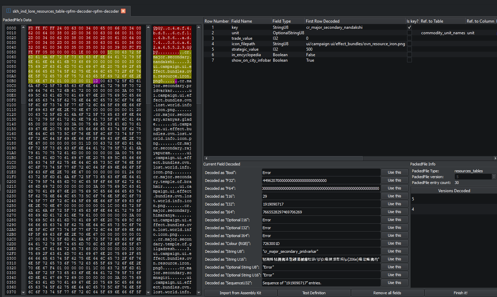

# The DB Decoder

The DB Decoder is a low-level tool for reverse-engineering or fixing a DB table's binary layout. You only need it when:

- A game patch changed a table's columns and the schema is now wrong (rows decode as garbage, or fail outright).
- You're adding support for a previously unknown table.

For routine editing, you want the [DB editor](./db.md). The Decoder is a development tool.

## Opening the Decoder

Right-click a DB file in the Pack tree → **Open ▸ Open with Decoder**. The file opens in its own tab and the decoder takes over the whole tab.

## Layout

The decoder isn't a "preview-the-table" view. It's a byte-walker: a cursor moves through the file, and you commit one field at a time to the schema. The tab is laid out as:

- **Hex pane** (top-left) — three monospace columns: byte offsets, raw hex bytes, and the ASCII rendering. The header bytes are shaded one colour, the bytes already covered by the schema you're building are shaded another (yellow on light themes), and the next byte the cursor is sitting on is shaded a third (magenta on light themes).
- **Fields table** (top-right) — one row per field already committed to the schema. Columns include *Field Name*, *Field Type*, *First Row Decoded* (the value at that position in row 1 of the file), *Is key?*, *Ref. to Table*, *Ref. to Column*, *Lookup Columns*, *Default Value*, *Is Filename*, *Filename Relative Path*, *CA Order*, *Description*, *Bitwise Fields*, *Enum Data*, *Is Part of Colour*. Right-click a row for **Move Up / Down / Left / Right / Delete**.
- **Current Field Decoded** (middle) — for the bytes at the current cursor position, this panel shows what they would decode to as **every** supported type, side by side. Each row is one type, with a line edit showing the candidate value and a **Use this** button that commits that type as the next field and advances the cursor.
- **PackedFile Info** (right) — table type, an editable version (spinbox), and the entry count read from the header.
- **Versions list** (right, bottom) — every other version of this table that the schema already knows about. Right-click for **Load definition** (replace the in-progress definition with that version's) or **Delete definition** (remove that version from the schema).
- **Buttons** (bottom row) — **Import from Assembly Kit**, **Test Definition**, **Remove all fields**, **Finish it!**.

There is no live preview of the decoded table.

## Workflow

### 1. Read the header

DB files start with: an optional GUID block, an optional version block, a one-byte flag, and a `u32` entry count. The decoder reads this for you on open and pre-shades that region in the hex pane — your cursor starts immediately after it.

### 2. Pick a starting point (optional)

Three shortcuts before you start decoding by hand:

- **Import from Assembly Kit** — if the AK ships a definition for this table, load it and let the decoder render it. Most often the right starting point.
- **Versions list → Load definition** — if a previous version of this table is in the schema, load it and only fix what changed (CA usually adds columns rather than reshuffling the layout).

### 3. Commit fields one at a time

For each field, look at the **Current Field Decoded** panel and pick the row whose value looks plausible (a string that reads as text; an integer in a believable range; a float that isn't `1e-39`). Hit **Use this** on that row. The cursor advances by the size of that type, the field appears in the fields table, and the panel updates with the next set of candidates.

The supported types are: `Boolean`, `F32`, `F64`, `I16`, `I32`, `I64`, `OptionalI16`, `OptionalI32`, `OptionalI64`, `ColourRGB`, `StringU8`, `StringU16`, `OptionalStringU8`, `OptionalStringU16`, `SequenceU32`. There is no `I8`, the colour type is `ColourRGB` (no alpha), and the only sequence variant is `SequenceU32`.

After committing, edit the row in the fields table to fill in the **Field Name** (this is what becomes the column header in the DB editor) and any other metadata you have — key flag, references to other tables, default value, etc.

If you commit the wrong type, right-click the field and use **Move Up / Down** to reorder, **Delete** to remove it (which rewinds the cursor by that field's size), or just hit **Remove all fields** and start over.

### 4. Test

**Test Definition** re-decodes the *current file* with the in-progress definition. On success you get a "Seems ok." dialog. On failure you get the decoder error, with extra context for incomplete decodes (so you can see how far it got before things went wrong).

The decoder doesn't iterate over multiple files for you — to validate the definition against vanilla or other parent files, save it first, then open one of those files in the regular DB editor.

### 5. Save

**Finish it!** writes the definition into the active schema for the version shown in the **PackedFile Info** spinbox, and reloads any DB editor tabs already open on this table so they pick up the new definition.

### 6. Submit upstream

Schema changes saved locally only live in your install until you submit them. PR them to [`rpfm-schemas`](https://github.com/Frodo45127/rpfm-schemas) so everyone benefits — see [Schemas & patches](../reference/schemas.md).

## Tips

- Most schema breakages are "CA inserted a new column" rather than a wholesale layout change. Load the previous version from the versions list and walk the cursor up to the suspected insertion point — the candidates panel will tell you where the layout diverges.
- `SequenceU32` columns are recursive: a `u32` count followed by that many copies of an inner sub-row. Decode them last and expand them in the fields table to define the inner fields.
