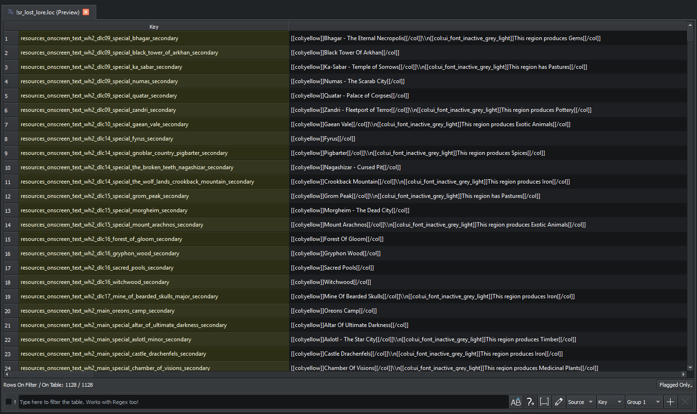

# Loc files

Loc files (anything ending in `.loc` — vanilla puts them under `text/`, mods conventionally use `text/db/` or `text/`) hold the localisation strings the game shows to the player. The Loc editor is a simplified DB editor with three columns: **key**, **text**, and **tooltip**.

## The columns

- **Key.** The string the game uses to look up the entry. Must be unique within the Pack. Conventionally namespaced (e.g. `units_descr_short_text_my_unit`).
- **Text.** The actual displayed string, in whatever language this loc file is for. Supports the engine's inline tags (`[[col:red]]`, `[[/col]]`, etc.) — RPFM doesn't validate them, but [Diagnostics](../search/diagnostics.md) will catch obviously broken pairs.
- **Tooltip.** Unknown. Historically called tooltip for some reason.

## Editing

Same controls as the [DB editor](./db.md): row add/remove/clone, find & replace, filter, sort by column, paste from spreadsheets, TSV round-tripping. The text columns are wide by default since most rows have multi-word values.

## Diagnostics for locs

Several entries in the [Diagnostics panel](../search/diagnostics.md) target locs specifically:

- **Empty key** / **empty text** — usually a typo or an accidental row.
- **Duplicated key** — two rows with the same key in the same Loc file.
- **Invalid escape sequences** — usually `[[col:…]]` tags without a matching closer.

Run diagnostics after a translation pass to catch the easy mistakes.

## TSV workflow for translators

The recommended flow for translating a mod is:

1. Open the mod in RPFM.
2. Use **Tools → Translator** to extract translatable strings into a structured editor (see [Translator](../tools/translator.md)) — this is the best path for full mod translations because it integrates with the [Total War Translation Hub](https://github.com/Frodo45127/total_war_translation_hub).

If you really want raw TSV instead, every Loc editor has **Export TSV** — translate in a spreadsheet, then **Import TSV** to bring the translation back in.
