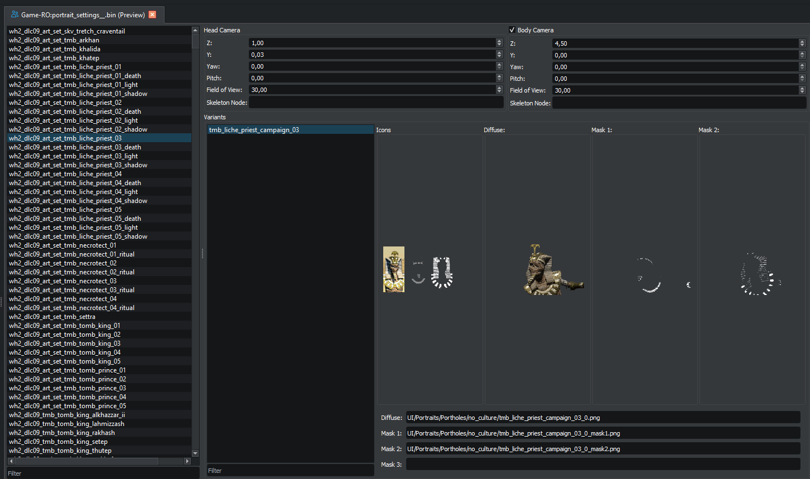

# Portrait Settings

Files matching `*portrait_settings*.bin` (typically under `ui/`) describe how a character's portrait is composed in-game: which art set the character belongs to, which variants of that art set are available, the head-and-body camera setup for each entry, and which texture files supply the diffuse and mask layers for each variant. The Portrait Settings editor gives you a structured view instead of a binary blob.

## Layout

The tab is one widget split between a **left list of entries** and a **right detailed view**.

- **Entries list** (left) — one row per "art set entry", keyed by its `art_set_id`. The id is what tables like `campaign_character_arts_tables.art_set_id` reference. A filter line edit sits above the list.
- **Detailed view** (right) — driven by the entry currently selected on the left. Contains, in order:
    - **Head camera** group box — z, y, yaw, pitch, distance, theta, phi, fov, skeleton node.
    - **Body camera** group box (checkable — toggle the title bar to enable/disable the body camera for this entry) — z, y, yaw, pitch, fov, skeleton node.
    - **Variants** group box — its own filtered list of variants belonging to this entry. Selecting a variant fills the rest of the panel.
    - **Variant fields** — diffuse file, mask 1 / 2 / 3 file paths (line edits), season (string), level (spinbox), age (spinbox), politician (checkbox), faction leader (checkbox).
    - **Texture previews** — four group boxes (diffuse, mask 1 / 2 / 3) that render the actual texture from the referenced path (with a fallback search that swaps `/portholes/` for `/units/`). The previews refresh ~500ms after you finish editing the path.

Which fields are visible depends on the file's binary version: older versions hide the fields that didn't exist yet (e.g. version 1 has only the spherical head-camera fields and no body camera; version 4 omits season/level/age/politician/faction-leader and the spherical head fields). The editor adjusts visibility automatically on load.

## Operations

All operations are **right-click context menus** on the two list views, not toolbar buttons. There is no toolbar.

On the entries list:

- **Add** — create a new empty entry.
- **Clone** — duplicate the selected entry (disabled until you have a selection).
- **Delete** — remove the selected entry (disabled until you have a selection).
- **Delete filtered-out rows** — once a filter is active in the entries list, delete every entry that the filter is currently hiding. Useful for trimming an entry set down to only the rows that match a pattern.

On the variants list:

- **Add**, **Clone**, **Delete** — same semantics, scoped to the selected entry's variants. There is **no** "delete filtered-out rows" on the variants list.

Beyond that:

- **Edit fields** — change spinboxes, line edits, checkboxes directly. All changes are buffered into the selected list item and committed when you save the file. There is no separate "apply" step.
- **Filters** — the entries filter and the variants filter are independent line edits with case-insensitive substring matching, debounced behind a short timer.

## Diagnostics integration

The Portrait Settings checks in [Diagnostics](../search/diagnostics.md) cover:

- **Datacored Portrait Settings file** — the file is identical to a vanilla one and adds nothing.
- **Invalid Art Set Id** — the entry's `art_set_id` isn't declared in `campaign_character_arts_tables.art_set_id` (across vanilla, parents, and the open Pack).
- **Invalid Variant Filename** — a variant's filename isn't declared in `variants_tables.variant_filename` (or `variant_name`, as a fallback for older games).
- **Missing texture file** — for each variant, separate checks for the diffuse and the three masks: the referenced path doesn't exist anywhere in the open Pack, parents, or vanilla.

For a tidy mod, run diagnostics after a portrait pass — it'll catch most of the small mistakes that produce missing-portrait icons in-game.
