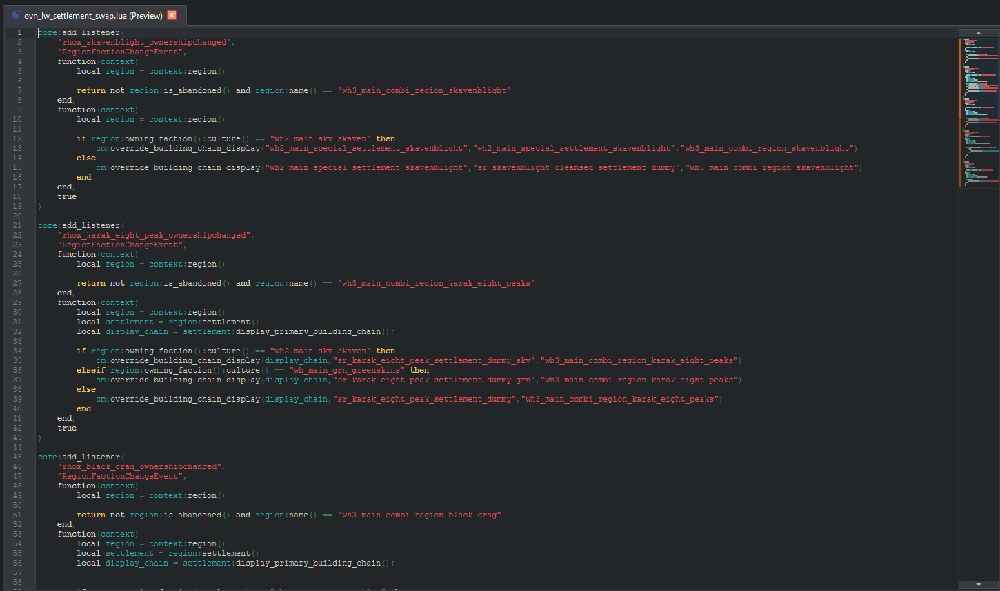

# Text & scripts

Anything text-shaped opens in the text editor. RPFM uses **KTextEditor** under the hood, which means proper syntax highlighting, line numbers, find/replace, multi-cursor and the rest of the modern code-editor toolkit — for free, on every supported language.

## What counts as "text"

RPFM auto-detects text-shaped files by extension. The editor handles, among others:

- **Scripts** — Lua, Python, batch files, shell.
- **Markup** — XML, HTML, JSON, YAML, TOML, INI.
- **Shaders** — HLSL, GLSL, CG, FX.
- **CA-specific** — `.battle_script`, `.twui`, `.twui.xml`, `.kfa`, `.kfc`, `.kfp`, `.tweak`, `.environment`.
- **Plain** — `.txt`, `.md`, `.csv` (when not opened as a table).

For the full list, see the [`rpfm_lib::files::text` module](../../api/rpfm_lib/files/text/index.html).

## Features

The KTextEditor backend gives you:

- **Syntax highlighting** for every detected language.
- **Find / replace** (`Ctrl+F` / `Ctrl+R`) with regex support.
- **Multi-cursor / column selection** (`Ctrl+Alt+click`).
- **Bookmarks** and quick-jump.
- **Code folding** for languages that support it.
- **Indent / unindent** (`Tab` / `Shift+Tab`).
- **Open / save** integration with the Pack — your edits go into the in-memory Pack on save.

## Lua scripts

When a diagnostics check runs, its results for the open script are shown in the editor itself, like in an IDE: the offending code is underlined, and its line gets a mark in the margin. See [Diagnostics](../search/diagnostics.md) for the checks performed.

Hovering a documented function, accessor or event in a Lua script shows its docs. Both features rely on the scripting docs of the game's Assembly Kit, completed with the vanilla scripts from the [dependencies cache](../packs/dependencies.md), so they need the Assembly Kit path set and the cache generated. To run a mod's scripts outside the game, see [Lua tests](../packs/lua-tests.md).

## External editor

If you'd rather use VS Code, Neovim or anything else, **Open with External Program** from the Pack tree's right-click menu extracts the file to a temp folder and opens it with your OS's default app for that extension; saving it externally pushes the change back into the Pack. There's no per-extension override inside RPFM — the OS picks the app.
