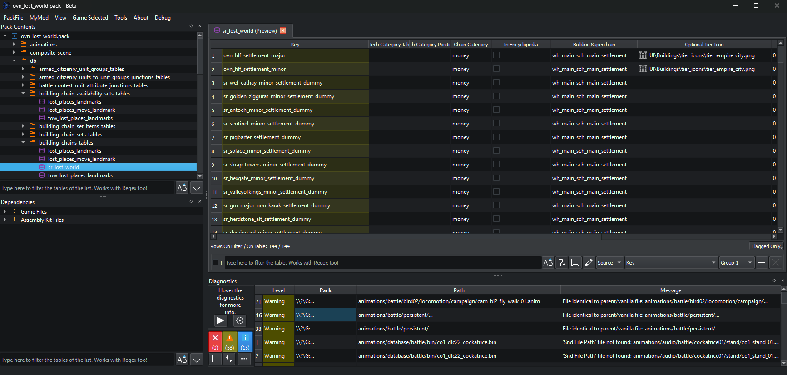

# What is RPFM?

**Rusted PackFile Manager** (RPFM) is a modding tool for every Total War game from *Empire* (2009) onwards. It's a Rust + Qt6 reimplementation of the original *PackFile Manager* (PFM), built to be fast, accurate and pleasant to spend hours in.

## What it does

In modern Total War games, the data the engine utilizes lives inside `.pack` files: archives that bundle DB tables, localisation strings, scripts, models, textures, animations, sounds and more. Modding the game means producing your own Pack and telling the launcher to load it on top of the vanilla data.

RPFM is the editor where that Pack is built. It opens, inspects, edits and saves Packs, and ships editors/viewers for every common file type inside them:

- **DB tables** — schema-aware grids with lookups, references, sorting, filtering, spreadsheet copy/paste and TSV import/export.
- **Loc files** — localisation tables with TSV import/export.
- **Text & scripts** — Lua, XML, JSON, HLSL and dozens of other text formats with KDE syntax highlighting.
- **Animations** — AnimPack, AnimTable, AnimFragment, MatchedCombat.
- **Models & visuals** — RigidModel, DDS/atlas images, Portrait Settings.
- **Video** — the proprietary `CA_VP8` format.
- **Specialised** — ESF (saves and startpos), BMD (battle maps), and a few more.

Beyond editing individual files, RPFM understands a Pack as a whole and how it relates to the rest of the game data. That's where the more interesting features live:

- **Diagnostics** that catch invalid references, missing locs, broken portrait variants, animation gaps and dozens of other classes of mod bugs before the game does.
- **Global Search** with regex across the open Pack — or across vanilla and parent mods too.
- **Dependency manager** that keeps track of vanilla data and parent mods and powers reference lookups everywhere else.
- **Pack optimiser** that strips ITM rows, datacore deletes and unused content to keep the final Pack lean.
- **MyMod** workspaces that bundle a Pack with its assets and templates, with one-click install to the game folder.
- **Translator** that makes keeping mod translations up to date painless.

## How RPFM is built

RPFM is split into two cooperating processes:

- **`rpfm_ui`** — the Qt6 desktop application you interact with. Everything you see — menus, editors, dialogs — lives here.
- **`rpfm_server`** — a headless backend that does the heavy work: file I/O, schema decoding, diagnostics, search, dependency resolution. The UI launches it automatically.

This split exists because the same backend is also exposed over WebSocket and the [Model Context Protocol][mcp], so AI tools and other clients can drive Total War file editing programmatically. If you're a tool author, see the [Server](../server/overview.md) section.

[mcp]: https://modelcontextprotocol.io/

## A note on PFM

If you've used the original PackFile Manager, the menus and layouts will feel familiar — that's deliberate. RPFM started as a straight reimplementation of PFM in Rust and Qt and has grown well past it, but the muscle memory should still mostly transfer.

## Where to go next

- [Installation](./installation.md) — get RPFM on your machine.
- [First-time configuration](./first-time-config.md) — point RPFM at your games so the smart features can do their job.
- [The main window](../packs/main-window.md) — orient yourself in the UI.

You can always reach this manual from inside RPFM via **About → Open RPFM Manual**, or by clicking in the manual button in the welcome page.
