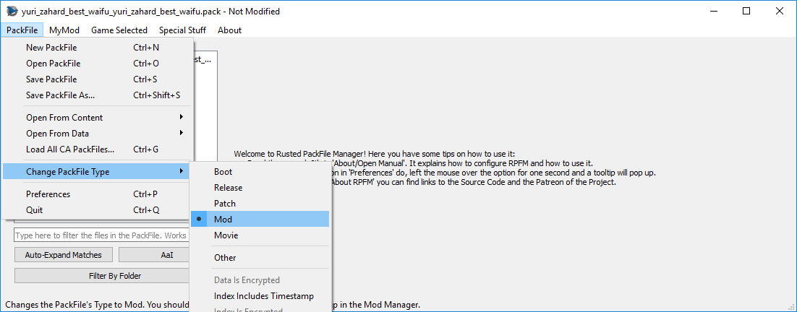

# `PackFile` Menu

Here, we can find the *basic* actions:
- `New PackFile`: Creates a new PackFile outtanowhere.
- `Open PackFile`: Opens one or more PackFiles in RPFM.
- `Save PackFile`: Saves the changes done in a PackFile to disk.
- `Save PackFile As`: Saves the current PackFile with another name.
- `Settings`: Open the Settings window.
- `Quit`: Makes you enter in a lottery. Seriously.

And some more... *specific* ones:
- `Install`: Copies the currently open PackFile to the data folder of the game.
- `Unistall`: Removes the currently open PackFile from the data folder of the game.
- `Open Recent…/xxx.pack`: Open a recently open PackFile.
- `Open From Content…/xxx.pack`: Open the selected PackFile from the *Content* folder (Workshop mods) of the game. Requires the game's path to be configured.
- `Open From Data…/xxx.pack`: Open the selected PackFile from the *Data* folder of the game. Requires the game's path to be configured.
- `Open From Autosave…/xxx.pack`: Open the selected PackFile from the *Autosave* folder. The autosaves are Per-Pack and sorted from newest to oldest, so if you want to load the last autosave done, pick the first one.
- `Load All CA PackFiles`: Creates a fake PackFile in memory and tries to load into it all the data from every Vanilla PackFile of the game. Keep in mind that this takes a while. Disabled if you have dependencies loaded in the dependencies panel.
- `Change PackFile Type`: Allows you to change the open PackFile's Type and configure some options for it.

About the **PackFile Types**, it's what the game uses to *load in order* all the data of the game. There are the following types, in *the order the game will load them*:
- `Boot`: Used by *boot.pack*. Not useful for modding. First to load.
- `Release`: Used by most of CA PackFiles. Not useful for modding.
- `Pactch`: Used by some CA PackFiles, specially in Shogun 2 and older games. Not useful for modding.
- `Mod`: Used by most mods. This is the one you'll mostly use.
- `Movie`: Used by some CA PackFiles and some specific mods. Useful for modding. Last to load.
- `Other`: Something for RPFM to categorize unrecognized types. Never use it.

There are also a few more options to configure a PackFiles under this menu:
- `Header Is Extended`: The header of the PackFile is extended (only seen in arena).
- `Index Includes Timestamp`: There is a timestamp, maybe a *Last Modified Date* in the index of the PackFile.
- `Index Is Encrypted`: The index of the PackFile is encrypted.
- `Data Is Encrypted`: The data of the PackFile is encrypted.
- `Data Is Conpressed`: The data of the PackFile is compressed.

About these options, just take into account that any PackFile with any of these options enabled (except `Data Is Compressed`) will **NOT BE RECOGNIZED** as a mod by the launcher. And RPFM doesn't support saving PackFiles with `Index Is Encrypted`, `Data Is Encrypted` or `Header Is Extended` enabled.

And, if you don't enable `Allow Editing of CA PackFiles`, RPFM will not let you save `Boot`, `Release` or `Patch` PackFiles.

And with that, we finish the `PackFile` Menu. Next, the `MyMod` menu.
