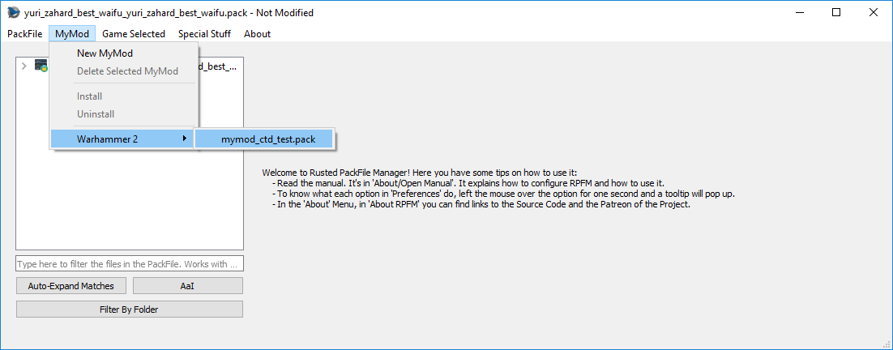
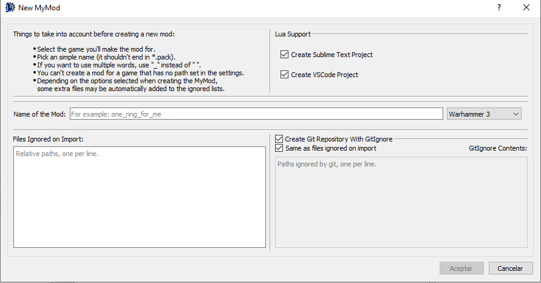

# `MyMod` Menu

`MyMod` is a feature to help modders **keep their mod's data organized**. The system started as an almost 1:1 clone of PFM's *MyMod* feature and expanded from there, so it should be easy to use for veterans too.

For those new to the concept, remember that `MyMod` folder we set in the settings? When we create a `MyMod`, in that folder will be created a folder for the game the mod's for (if it didn't exist before), and inside that there will be a PackFile and a folder, both with the name of your mod. Each time you extract something from the PackFile, it'll be automatically extracted in his folder, **mirroring the structure it has in the PackFile**. For example, extracting a table will result in the table being extracted at `mymod_folder/db/table_name/file`. Adding Files/Folders from the MyMod folder **will also add them mirroring the path they have**. For example, adding a file from `mymod_folder/db/table_name/file`_ will add the file in `PackFile/db/table_name/file`.

This makes easier to keep track of the mod files, and you can even **put that folder under .git**, or any other version control system, as you can have an unpacked mod that you can pack with a single click (well, a few clicks).

The `MyMod` Menu has the following buttons:
- `Open MyMod Folder`: Opens the `MyMod` folder in your default file explorer.
- `New MyMod`: It opens the `New MyMod` Dialog. It's explained under this list.
- `Delete Selected MyMod`: It deletes the currently selected `MyMod`. This cannot be undone, so you'll got a warning before doing it.
- `Import`: Import the content of the `MyMod` folder of the currently open `MyMod` PackFile into said PackFile.
- `Export`: Extract the current `MyMod` PackFile into its `MyMod` folder.
- `XXX/yourmod.pack`: Open your previously created `MyMod` to edit, delete, install,.... whatever you want, baby!

When we click on `New MyMod`, the following dialog will appear:

Here you can configure the `MyMod` with the features you want. Once you're done, hit `Save` and your new `MyMod` will be created and opened.

And lastly, a couple of aclarations:
- To be able to use `Import/Export` you need to have your `MyMod` open.
- Only `MyMod` PackFiles opened from `XXX/yourmod.pack` will enjoy the `MyMod` features, like keeping the paths when adding/extracting files. Manually opened `MyMod` PackFiles will be treated as regular PackFiles.
