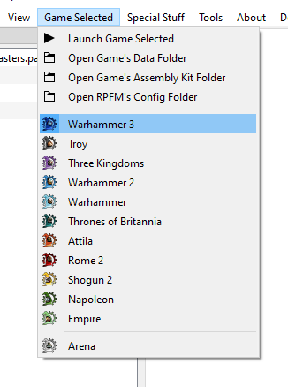

# `Game Selected` Menu

In this menu you can **change the currently selected game**. When opening PackFiles, RPFM tries to be smart and auto-select a game, but there are some PackFiles that are the same between games (for example, Attila and Warhammer 1 PackFiles are identical), so... just make sure the right game is selected after opening a PackFile, as that affects how many parts of the program work. The complete list of supported games is:
- `Three Kingdoms`: Full Support.
- `Warhammer 2`: Full Support.
- `Warhammer`: Full Support.
- `Thrones of Britannia`: Full Support.
- `Attila`: Full Support.
- `Rome 2`: Full Support.
- `Shogun 2`: Full Support.
- `Napoleon`: Almost Full Support. Missing `Generate PAK File` support.
- `Empire`: Almost Full Support. Missing `Generate PAK File` support.
- `Arena`: Read-Only Support for PackFiles. Incomplete schema.

Also, at the top we have a couple of convenient buttons to open certain folders on the default file manager of your system:
- `Launch Game Selected`: A quick shortcut to launch the currently selected game.
- `Open Game's Data Folder`: Open your currently selected game's data folder, if it has his path configured in the settings.
- `Open Game's Assembly Kit Folder`: Open your currently selected game's assembly kit folder, if it has his path configured in the settings. Only for Rome 2 and later games.
- `Open RPFM's Config Folder`: Open the config folder of RPFM, which contains configs, shortcuts, schemas, crashlogs, porn,....
