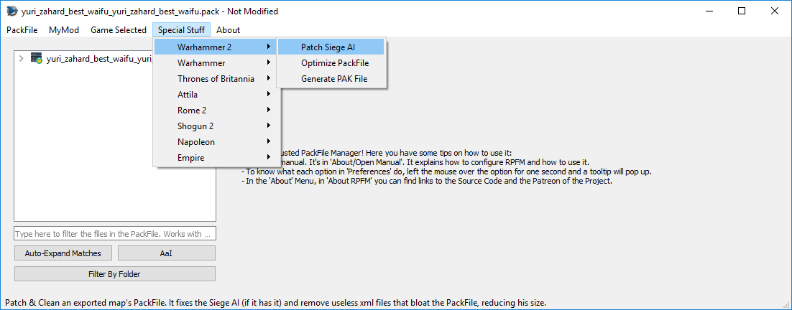

# `Special Stuff` Menu

This menu contains... special features implemented for specific games. Basically, any feature that **doesn't really fit in any other place** goes here. Here we have:
- `Patch SiegeAI`: used in Warhammer 1 & 2 for **creating siege maps that the AI can handle**. Basically, make your map with the stuff required for the AI to work, and then patch his PackFile with this.
- `Optimize PackFile`: reduces the size of your PackFile and increase its compatibility with other mods by *cleaning* certain stuff on your packfile:
    - **DB**: Removes unchanged rows from vanilla. If table is empty, it removes it. Ignore files called the same as the vanilla ones (unless you disable that in the settings).
    - **Loc**: Removes unchanged rows from vanilla.
    - **Xml**: Removes xml files under the `terrain/tiles` folder, as those are leftovers of Terry's exports..
- `Generate PAK File`: generates a file from raw data from the Assembly Kit that allows RPFM to provide a ton of reference data from tables not in the game. Or easier to understand, if you use the dependency checker, you'll have **far fewer blue columns**. Doesn't work for Empire and Napoleon, yet.
