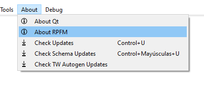

# `About` Menu

Pretty simple and straightforward menu:
- `About QT`: Shows info about the version of Qt (the framework RPFM uses for the UI) in use.
- `About RPFM`: Shows info about the version of RPFM in use, and the credits.
- `Open Manual`: Opens this manual on the web browser you have as *Default*.
- `Support me on Patreon`: Open ***RPFM***'s Patreon page. In case you want to contribute with money or you want to check the dev blog
- `Check Updates`: Checks if there is a newer version of RPFM available.
- `Check Schema Update`: Checks if there is any newer version of RPFM's Schemas available and downloads it.

The *Schemas* I talked in the last point are what **allows RPFM to decode and open the tables** of all the supported games. Newer schemas means more tables to open. It's very common that after an update a few tables change his structure and are no longer decodables. To get them to work again, the schema has to be updated.

And that's all for the top `Menu` Bar. Now we'll take a look at the thing you're going to use the most (or almost the most): the `TreeView`.
