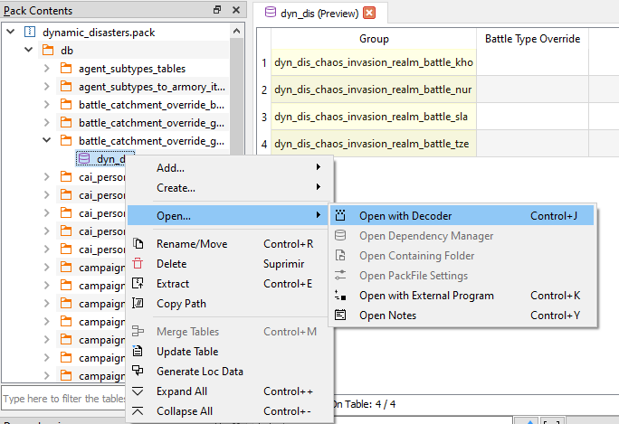

# PackFile TreeView

That thing on the left with folders and stuff is the **PackFile's TreeView**. That's where all the files inside your PackFiles will show up. If you don't like it there, it can be moved elsewere, or even closed. When you Right-Click on any of them, this context menu will show up:

These are the actions you can use to alter the PackFile. Each one of them has a hotkey, in case you're a lazy bastard. These are all the actions in the menu:

- `Add…/Add File`: Allows you to add one or more files to the PackFile.
- `Add…/Add Folder`: Allows you to add a folder and all his files to the PackFile.
- `Add…/Add from PackFile`: Allows you to add files or folders from another PackFile to your PackFile. Just, select whatever you want to add, double click it and it'll be added to your PackFile, keeping his path.
- `Create…/Create Folder`: Allows you to create an empty folder. Due to how PackFiles work empty folders are not saved so, if you want to keep the folder, add a file to it. Supports relative paths.
- `Create…/Create AnimPack`: Allows you to create an empty AnimPack.
- `Create…/Create DB`: Allows you to create an empty DB Table.
- `Create…/Create Loc`: Allows you to create an empty Loc PackedFile. You can create his relative path too writing something like `folder1/folder2/file` instead of just the file name.
- `Create…/Create Text`: Allows you to create an empty text file. ANY TEXT FILE (including lua, xml,...). You can create his relative path too writing something like `folder1/folder2/file` instead of just the file name.
- `Create…/Create Queek File`: Allows you to create a file based on the context. The current contexts where this works are:
    - `db/x_tables`: It creates a new empty db table of the last version supported by the game selected.
    - `text/`: It creates a loc file.
    - `scripts/`: It creates a LUA script.
    - `variantmeshes/variantmeshdefinitions/`: It creates a variantmesh file.
- `Create…/Mass-Import TSV`: Allows you to import a bunch of TSV files at once. The system is able to distinguish between DB and Loc TSV files, so you can import all of them at the same time, and RPFM will create all the files needed, in their correct place.
- `Create…/Mass-Export TSV`: Allows you to export as TSV every DB Table and Loc PackedFiles in your PackFile at once.
- `Open…/Open with Decoder`: Allows you to open a table in the `PackedFile Decoder`. Only used to decode new tables, so…. You shouldn't touch this.
- `Open…/Open Dependency Manager`: Allows you to open the list of dependencies included in the PackFile. Check the next chapter to learn what this `Dependency Manager` thing is about.
- `Open…/Open Containing Folder`: Allows you to open the folder where your open PackFile is (if it's on disk) with the default file manager of your system.
- `Open…/Open PackFile Settings`: Allows you to open the PackFile-specific settings of the currently open PackFile.
- `Open…/Open with External Program`: Allows you to open a PackedFile with an external program. For tables and locs, some internal magic is done so they're openable in excel/calc/the program your tsv files open with.
- `Open…/Open Notes`: Allows you to open a Notes panel, to random stuff related to the PackFile.
- `Rename`: Allows you to rename whatever is selected, except the PackFile.
- `Delete`: Allows you to delete whatever is selected. If the PackFile is selected, it removes every file from it.
- `Extract`: Allows you to extract whatever is selected out of the PackFile. If whatever you selected is compressed/encrypted, RPFM will decompress/decrypt it before extracting, so the resulting file is usable.
- `Copy Path`: Allows you to copy the selected item's path to the clipboard.
- `Merge Tables`: Allows you to merge multiple DB/LOC Tables into one.
- `Update Table`: Allows you to update the structure of a table to the latest one one used by the game selected.

Additionally, with the shortcuts `Ctrl++` and `Ctrl+-` you can expand/collapse the entire TreeView. This action is shortcut only, it's not in the Contextual Menu.

Keep in mind that the availability of these actions depends on what is selected, and on the currently loaded schemas. For example, you can't add anything if you have selected a PackedFile. Also, keep in mind that if there is a `MyMod` loaded, some of these actions may work different.

Also, when you add/modify a file, it's marked in the TreeView with the following colour code:

- **Green/Dark Green** : added file.
- **Yellow/Dark Yellow** : modified file.
- **Magenta/Dark Magenta** : added AND modified file.

This colour code is applied to the parents too, up to the PackFile, so you easily know what you changed since the last time you saved the PackFile.

And last, the  **TreeView Filter**. It's that thing with buttons at the bottom of the TreeView. It allows you to filter the contents of the TreeView by a pattern (Works with Regex!). The buttons below the filter bar where you write the pattern are:

- `Auto-Expand Matches`: automatically expand all the matched folders/files. This combined with a ton of matches (empty pattern and +60k files in data.pack) can hang the program for a while, so be cautious on when do you use it.
- `AaI`: the case sensitive button. Not too much to explain here.
