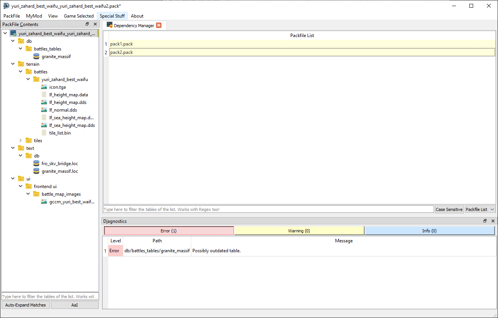

# Dependency Manager

The `Dependency Manager` allows you to modify a special list of PackFiles saved inside your mod's PackFile. When starting the game, the launcher will try to load the PackFiles in this list BEFORE your PackFile. If a PackFile is not found, it'll be ignored. This list can be used to hardcode dependencies into your PackFile. In his Contextual Menu (right-click) you can find more or less the same commands of a DB Table.