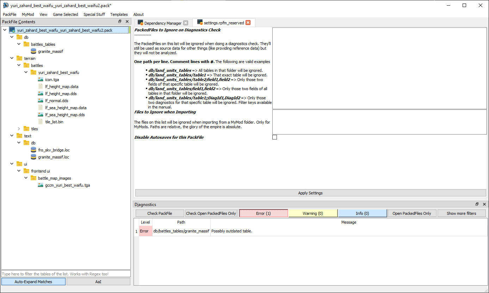

# PackFile Settings

`PackFile Settings` are a list of PackFile-specific settings, that can change some of RPFM behaviors only for the currently open PackFile. They're kept inside the PackFile, so every time you open that PackFile again, they will be re-applied. The list of settings goes as follows:

- **PackedFiles to Ignore on Diagnostics Check**: The list of PackedFiles that will be ignored when performing a diagnostics check. You can ignore entire folders, individual PackedFiles, specific columns of individual PackedFiles and specific diagnostics on individual PackedFiles. The format is as follows:
    * `db/land_units_tables` => All tables in that folder will be ignored.
    * `db/land_units_tables/table1` => That exact table will be ignored.
    * `db/land_units_tables/table2;field1,field2` => Only those two fields of that specific table will be ignored.
    * `db/land_units_tables;field1,field2` => Only those two fields of all tables in that folder will be ignored.
    * `db/land_units_tables/table1;;DiagId1,DiagId2` => Only those two diagnostics for that specific table will be ignored.
    * Comment lines should start with `#`.
    * The diagnostic keys used to disable specific diagnostics are:
        - `OutdatedTable` => Outdated table.
        - `InvalidReference` => Invalid reference.
        - `EmptyRow` => Empty row.
        - `EmptyKeyField` => Empty key field.
        - `EmptyKeyFields` => Empty key fields.
        - `DuplicatedCombinedKeys` => Duplicated combined keys.
        - `NoReferenceTableFound` => No reference table found.
        - `NoReferenceTableNorColumnFoundPak` => No reference Table/Column found.
        - `NoReferenceTableNorColumnFoundNoPak` => No reference Table/Column/Dependencies found.
        - `InvalidEscape` => Invalid escape.
        - `DuplicatedRow` => Duplicated row.
        - `InvalidLocKey` => Invalid Loc Key.
        - `TableNameEndsInNumber` => Table Name ends in number.
        - `TableNameHasSpace` => Table name has space.
        - `TableIsDataCoring` => Table is data-coring.
        - `FieldWithPathNotFound` => Path/File in Field not found.
        - `BannedTable` => Banned Table detected.
        - `ValueCannotBeEmpty` => Value Cannot be Empty.
        - `InvalidDependencyPackName` => Invalid Dependecy PackFile
        - `InvalidPackName` => Invalid Pack Name
        - `DatacoredPortraitSettings` => Datacored Portrait Settings file.
        - `InvalidArtSetId` => Invalid Art Set Id
        - `InvalidVariantFilename` => Invalid Variant Filename
        - `FileDiffuseNotFoundForVariant` => File Diffuse not found for Variant.

- **Files to Ignore when Importing**: Paths here will be ignored when importing into a MyMod.
- **Disable Autosaves for this PackFile**: For big PackFiles.
