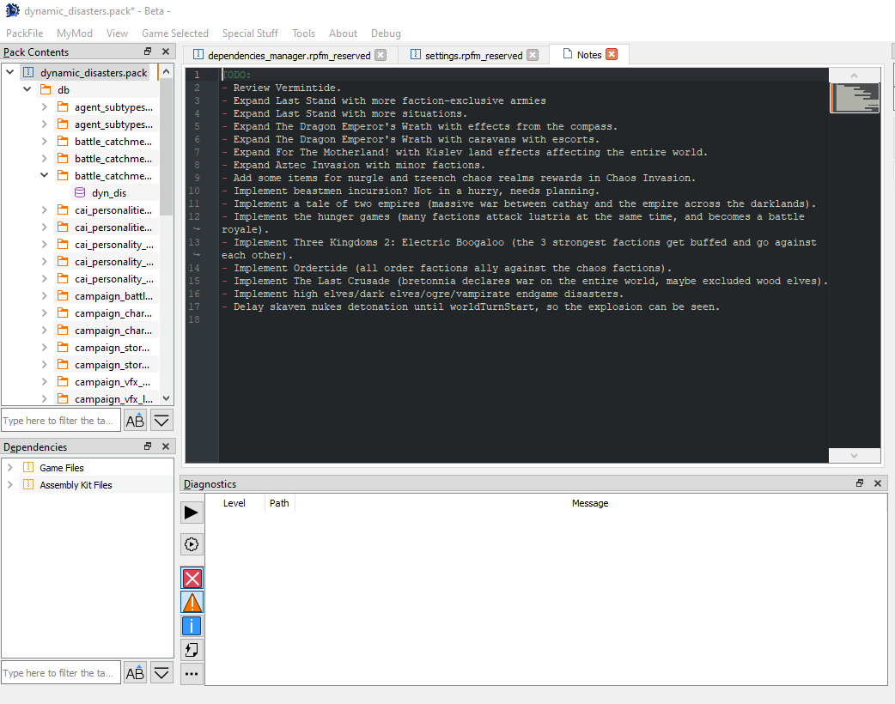

# Notes

`Notes` is a system of simple notes stored in the PackFiles. It's just a way to keep non-standard things (like *"this column is for X, remember it when changing Y!"*) in your PackFiles. You can have one note per PackFile. Use it for whatever you want.