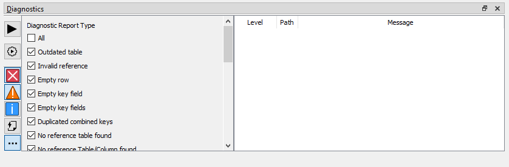

# Diagnostics Panel

`Diagnostics` panel allows you to quickly identify possible problems in your mod, so you can fix them before they're reflected in-game.

It's pretty simple. From left to right:
- `Check PackFile`: Performs a diagnostics check over the entire PackFile. If the relevant settings are enabled, this is done automatically on PackFile opening too.
- `Check Open PackedFile`: Performs a diagnostics check over the open PackedFiles, leaving the results of the other PackFiles as they are.
- `Error`: Enable showing error diagnostics.
- `Warning`: Enable showing warning diagnostics.
- `Info`: Enable showing info diagnostics.
- `Open PackedFiles Only`: Filter the diagnostics list to show only the diagnostics relevant to the open PackedFiles.
- `Show more filters`: Shows a toggleable list of per-diagnostic filter, for more granular filtering.

To know more about what each diagnostic means, hover the mouse over them and you'll get an explanation of what it means. Also, double-clicking them will led you to the relevant place where they are being detected.
