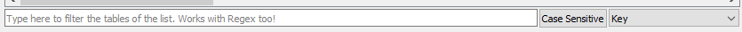

# DB Tables

`DB Tables` are where most of the moddable data of the games is. For example, unit stats, faction colors, buildings info,... RPFM has a complete integrated editor for them. The screenshot above is how a DB Table looks in RPFM when opened.

The editor includes ***cross-table references***, which means that, if one column references another table, you'll get a combo when editing that column with data to input from the other table. Also, if you hover over the header of any column that references another table, is referenced on another table, or **has a description in the schema**, you can see in the tooltip the column's special info.

All columns are also **movable**, so you can rearrange them however you want, and numeric columns (except long integer columns) have a **numeric-only editor**. And you can sort the table by one column one way or another, or remove the sorting with a third click in the column title.

At the bottom of the window you have a **real-time filter**. Select the column you want to use to filter, if you want it to filter as `Case Sensitive`, and just write and see how the table gets filtered as you type. It works with Regex too. For example, the following will only show up the rows that contain in their `Key` column `v_b` or `fake`:

Here you have a ***Regex Cheatsheet*** in case you want to use more complex filters: [https://www.cheatography.com/davechild/cheat-sheets/regular-expressions/](https://www.cheatography.com/davechild/cheat-sheets/regular-expressions/)

Now, with the Right-Click (or Contextual) Menu:

These are all the actions available for DB Tables:

- `Add Row`: Appends an empty row at the end of the table.
- `Insert Row`: Inserts an empty row after every row with a selected cell.
- `Delete Row`: Uses the computational power of your GPU to mine cryptocurrencies. Joking, it deletes any row with a selected cell.
- `Clone…/Clone and Insert`: Creates a duplicate of every row with a selected cell and inserts the duplicate just below the original row.
- `Clone…/Clone and Append`: Creates a duplicate of every row with a selected cell and appends the duplicates at the end of the table.
- `Copy …/Copy`: It copies whatever is selected to the Clipboard, in a format compatible with Excel, LibreOffice Calc and others.
- `Copy …/Copy as LUA Table`: It copies the entire table as a Lua "Map\<String, Vector\<data\>\>" if the table has a key field, or as a series of Vectors if it hasn't, ready to paste it in a script. For scripters.
- `Paste`: It tries to paste whatever is in the Clipboard to the selected cells. It does some clever things while pasting:
    - If only one cell was copied, it pastes it in all selected cells.
    - If only a few cells of a row were copied, and the amount of copied cells equals the amount of selected columns, it pastes the first item in every cell in the first selected column, the second item in every cell of the second selected column,...
    - If none of the above, it defaults to a normal paste.
- `Paste as New Row`: It allows you to paste the contents of the clipboard as a new row, appended at the end of the table.
- `Rewrite Selection`: Allows you to rewrite the contents of a complete selection with whatever you want. It also allows for some limited numeric operations.
- `Invert Selection`: Inverse the selection state of all cells on the table.
- `Reset Selection`: Reset all selected cells to the value they had when the table was initially open.
- `Resize Columns`: Resize all the columns to fit their contents.
- `Import TSV`: Allows you to import a TSV file to the table, overwriting whatever the table currently has. **IT'S NOT COMPATIBLE WITH PFM TSV FILES**.
- `Export TSV`: Allows you to export the table as a TSV File, compatible with Excel, Calc….
- `Search`: Open the *Search & Replace* panel, that you can use to search any text pattern you want in the table, and replace it if you want. It works in combination with the filter, so you can even do more precise searches combining them!
- `Sidebar`: Open a sidebar where you can select what columns hide/show and freeze/unfreeze.
- `Undo`: Allows you to undo… almost every action done in the table. Even TSV Imports.
- `Redo`: Allows you to undo every undo action. This goes deeper into the rabbit hole…

Tables uses the same colour code for cells and rows as the TreeView. And that's more or less what you can do with a DB Table.

Apart of these, the `Del` key in DB Tables acts as an `Smart Delete` key. This means depending on what you have selected when you press `Delete` it'll delete:
- **If you have selected random cells**, it'll delete their contents.
- **If you have selected a full row** , it'll delete the row from the table.
- **If you have a combination of both** , it'll delete rows where all cells are selected, and it'll delete the contents of the cells where not all cells in a row are selected. Fancy.

One thing to take into account is that if you want to write multiple lines in a cell (for example, for multiple paragraphs in one single cell) you **can write `\\n` and RPFM will take care of saving it properly**, so you see multiple lines ingame. Same with `\\t` for tablulations. And yes, two bars, not one.
