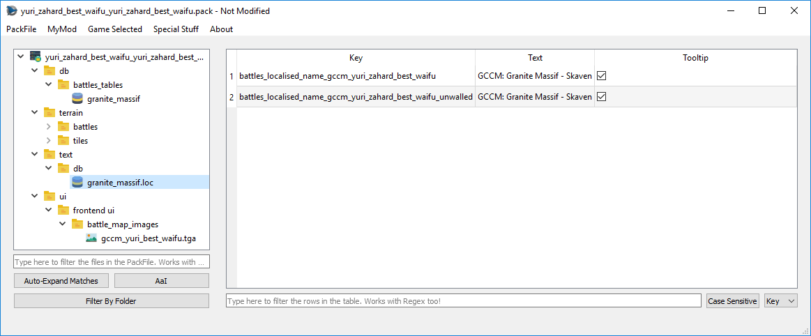

# LOC PackedFiles

Loc PackedFiles are files that end in `.loc`, and **contain most of the texts you see ingame**. When you open them, you can see they work like a… DB Table. They are really an special type of table, so you can do to them exactly the same stuff you do can do to DB Tables. Loc PackedFiles uses the same colour code for cells and rows as the TreeView.

One thing to take into account (and really, the only one) is that if you want to write multiple lines in a cell (for example, for multiple paragraphs in one single cell) you **can write `\n` and RPFM will take care of saving it properly**, so you see multiple lines ingame. Same with `\t` for tablulations.
