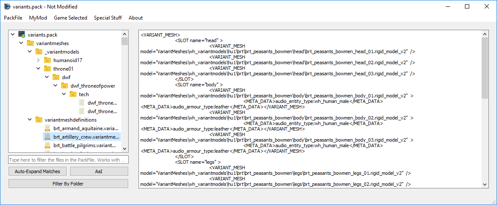

# Text PackedFiles

RPFM can open and edit a wide variety of Text PackedFiles, such as `XML, HTML, LUA, TXT,...`. It has native **Undo/Redo support, Copy/Paste support, Syntax Highlighting...** the normal things for a basic text editor.
