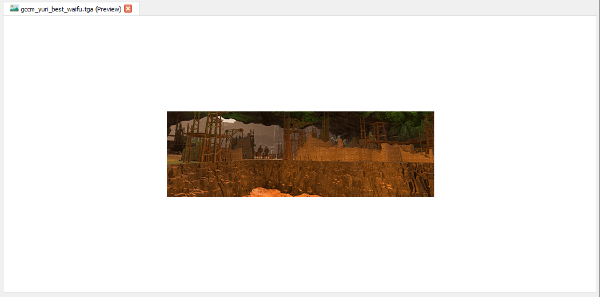

# Images

RPFM can open a variety of image formats, such as **PNG, JPG, TGA, DDS (most of them)...** Just select the image you want to see, and it'll open in the right side of the window. If it doesn't open, it's a format it cannot (yet) open.
