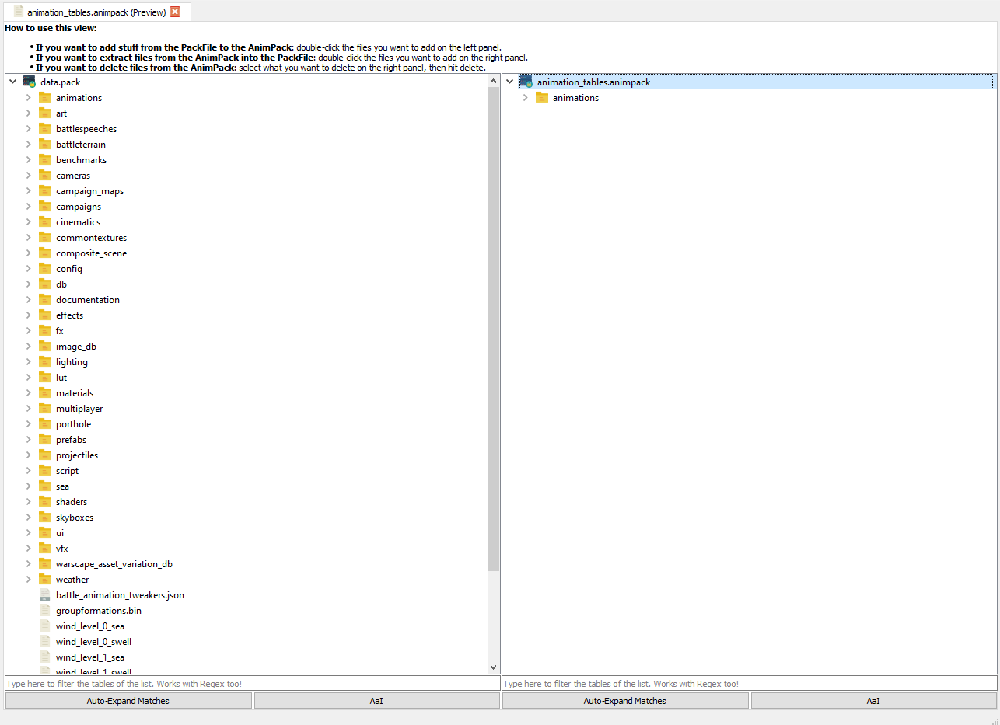

# AnimPacks

RPFM can open AnimPacks, and allows to add/remove files at will to/from them. The left view represents the currently open PackFile. The right view, your AnimPack.
- To add files to your AnimPack, just double-click what you want to add on the left view, and it'll be added to the AnimPack on the right.
- To Extract files from your AnimPack into the PackFile, just double-click the files you want to extract on the right view, and they'll be extracted into the left view.
- To remove files from the AnimPack, just select them and hit "Delete".

NOTE: All add/extract operations are copies, not moves. This means the original file will still be there after being added/extracted.
