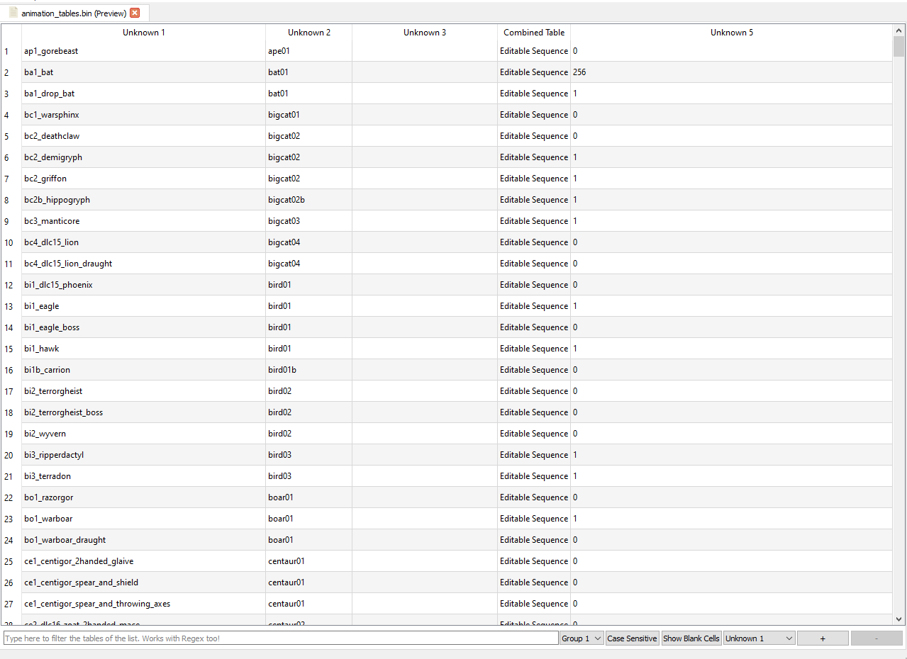

# AnimTables

AnimTables are DB-like tables with information about animations. Really, I'm not an expert on them. They're shown in debug views. Remember to hit the save button at the bottom or they'll not be saved.
