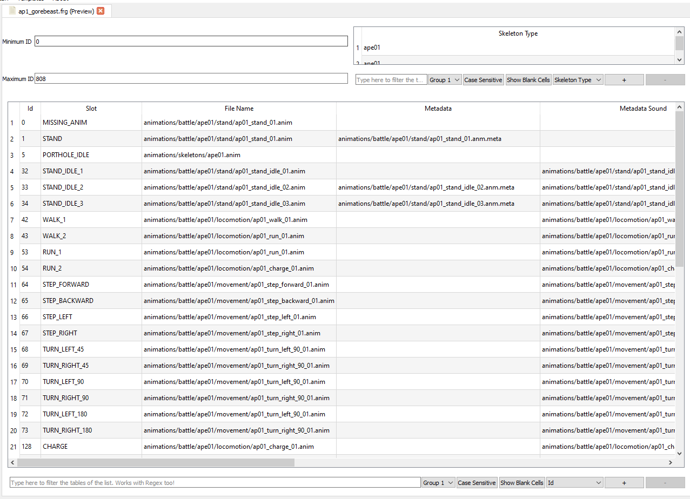

# AnimFragments

AnimFraments are DB-like tables with information about what animations use what units on what situations. Really, I'm not an expert on them. They're shown in debug views. Remember to hit the save button at the bottom or they'll not be saved.
