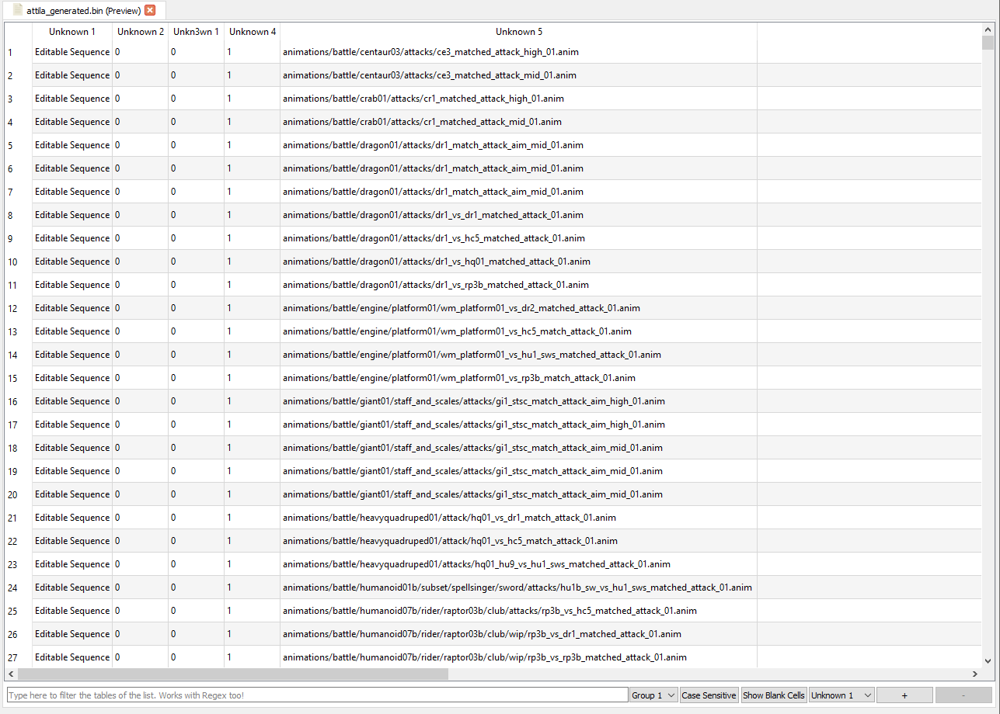

# MatchedCombat Tables

MatchedCombat Tables are DB-like tables with information about what animations use what units when they're in matched combat with other specific units. I think. Really, I'm not an expert on them.
