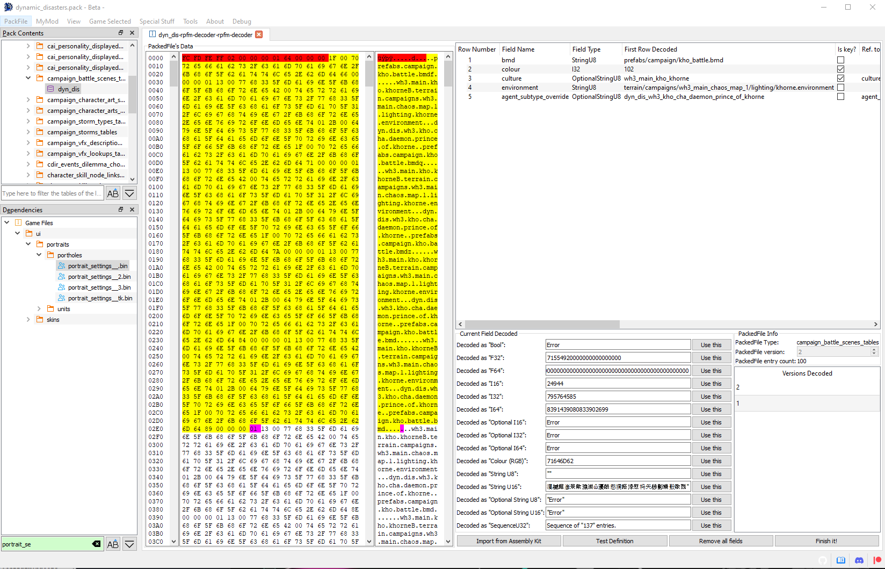

# DB Decoder

RPFM has an integrated **DB decoder**, to speed up a lot the decoding process of the **definition** of a table. It can be opened by right-clicking on a table file and selecting `Open/Open with Decoder`. Only works on tables.

The decoder screen is a bit complex so, like Jack the Ripper, let's check it in parts, one at a time. Starting by the left we have this:

This is the `PackedFile's Data` view. It's similar to a hexadecimal editor, but far less powerful, and it's not editable. In the middle you have **Raw Hexadecimal Data**, and in the right, you have a **Decoded version** of that data. To make it easier to work with it, both scrolling and selection are synchronised between both views. So you can select a byte in the middle view, and it'll get selected in the right one too. The colour code here means:

- **Red** : header of the table. It contains certain info about what's in the table, like his uuid, amount of rows,....
- **Yellow** : the part of the table already decoded following the structure from the fields table.
- **Magenta** : the byte where the next field after all the fields from the fields table starts.

For performance reasons, this view is **limited to 60 lines**, which should be more than enough the decode the first row of almost every table. This limit may be removed in the future if I manage to fix the performance slowdown....

Next, to the right, we have this:

This is the `Fields List`. Here are all the columns this table has, including their title, type, if they are a `key` column, their relation with other tables/columns, the decoded data on each field of the first row of the table, and a *Description* field, to add commentaries that'll show up when hovering the header of that column with the mouse.

If we right-click in any field of the table, we have these three self-explanatory options to help us with the decoding:

And finally, under the `Fields List`, we have this:

The `Current Field Decoded` will show up the field that starts in the magenta byte of the `PackedFile's Data` view, decoded in the different types the tables use. It's use is simple: check what type makes more sense (for example, in the screenshot, it's evidently a `StringU8`), and click the `Use this` button in his row. Doing that will add a field of that type to the `Fields List`, and it'll update the `PackedFile's Data` View to show where the next field starts. Keep doing that until you think you've decoded the complete first row of the table, hit `Finish It!` at the right bottom corner, and select the table again. If the decoding is correct, the table will open. And that's how ~I met your mother~ you decode a table.

Under `Current Field Decoded` we have `Selected Field Decoded`. It does the same that `Current Field Decoded`, but from the byte you selected in the `PackedFile's Data` View. Just select a byte and it'll try to decode any possible field starting from it. It's for helping decoding complex tables.

To the right, we have some information about the table, and the `Versions List` (a list of versions of that table we have a definition for). If we right-click in one of them, we can load that version (useful to have something to start when a table gets *updated* in a patch) or delete it (in case we make a totally disaster and don't want it to be in the schema).

And at the bottom, we have:
- `Generate Diff`: generates a diff between your schema and the current schema (from Github) and saves it to RPFM's folder.
- `Remove all fields`: removes all decoded fields, returning the table to a clean state.
- `Finish It!`: Save the `Fields List` as a new definition for that version of the table in the schema. The definition is inmediatly available after that, so the changes can be used immediately.
