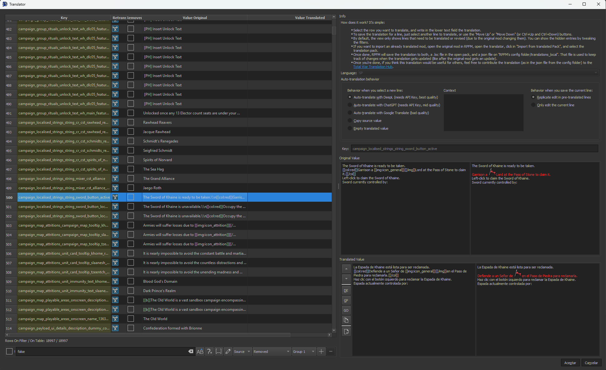
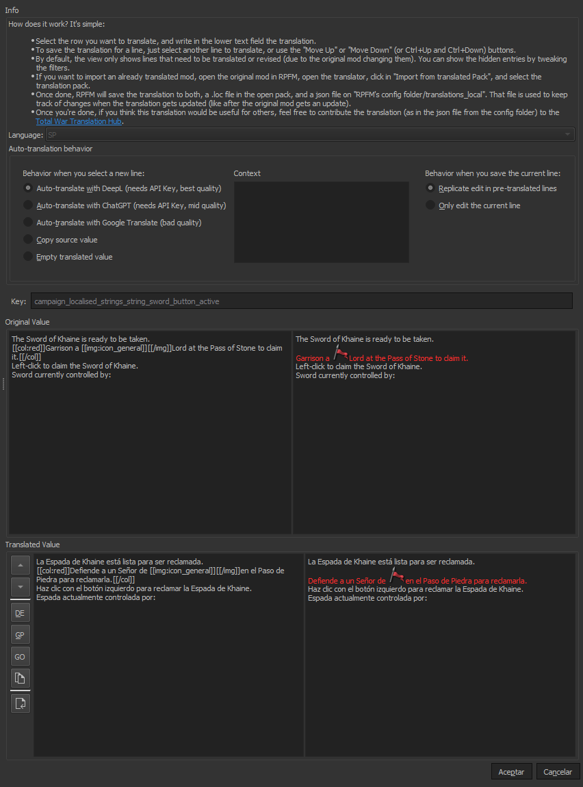

# How To Translate A Mod

There are three ways to translate a mod: **the simple way, the advanced way, and the new way**.

### The Simple Way

It's the one new modders tend to do, because it's the easier one:

- Open the Pack.
- Open the Loc files.
- Manually translate the loc values.
- Save the Pack.

It's not recomended because when the mod gets an update, you have to retranslate everything, or figure out a way to find the new/changed lines, translate those, then update your translation mod. And this can be a pain, and depending on how you do it, you can miss line changes leaving your translation ***working but partially outdated***.

### The Advanced Way

It's the one people that have been hit by the problems of the simple way tend to do:

- Open the Pack.
- Extract all locs to TSV.
- Use some software to help you translate the files.
- Import the locs back.
- Save the Pack.

There are many variants of this, ranging from simple **autotranslate everything with google** (if you do this WITHOUT PROOFREADING AND FIXING THE TRANSLATION I wish you a really painful death), to advanced workflows to isolate new/changed lines and only update those.

The pros of this is **translations are more easily updated** and it's **easier to keep track of the changes**. The cons are... that **it's more time-consuming**.

### The New Way

The new way is using RPFM's integrated Translator. It's really simple:

- Open the Pack you want to translate.
- Open the Translator (Tools/Translator).
- Translate the lines marked as *Need Retranslation*.
- Hit Accept.
- Save the Pack.

Why is this approach the recommended one? Because **the translator does a lot of the heavy work** for you, and fixes some problems that have historically plagued translations in Total War games. Specifically:

- It detects lines unchanged from the vanilla english translation, and translates them automatically using their official translation.
- When translating submods, it reuses translations from the parent mods if they exists and autotranslates lines reused from the parent mods using them.
- If you're updating a translation:
    - It detects lines which have been removed from the mod and marks them so you don't need to translate them.
    - It detects lines which have been altered on the mod, so you can update their translation.
    - It detects lines which are new, and promps you to translate them.
- Due to the way the translation data is stored, it's easy to share it with a team and collaborate on it.

This means, just by using it, you get:

- No more time wasted updating a translation. Just open the updated mod in the translator, hit accept, and done.
- No more lines changed in an update still using their old translation.
- No more lines with the same text using different translations, leading to mismatching terminology.

Additionally, these translations are used by TWPatcher to provide launch-time translation capabilities, meaning any launcher that uses TWPatcher (like Runcher) can automatically detect your mods, find translations for them, either online at the translation hub, or locally, and auto-apply them on runtime, fixing the dreaded *no text when no english* bug along the way. This means no more need to have 20 translation packs for your 20 mods!

### How to use the Translator

First, open the mod in the translator. The list of localisation lines in the mod is on the left, with the following structure:

- **Key**: Key of the loc line to translate
- **Needs Retrasnlation?**: If checked, the line needs to be translated, either because it's a new line, or because it was previously translated, but the mod changed that line at some point.
- **Removed**: If checked, the line is no longer in use in the mod. The translator automatically hides these.
- **Original Value**: The text that's in the mod in that line. Usually in english.
- **Translated Value**: The translated text for that line.

Next, the right side, where the configuration of the translator and the translation itself happens. At the top you have some instructions on how to use the tool and the language the translator is translating into, which is chosen based on which language you have the game on. Next is the **Auto-translation behavior** section, where you can configure how the translator acts every time you select/deselect a line from the list to translate:

- When you select a new line:
    - **Auto-translate with DeepL**: it uses DeepL to automatically translate the line, providing rather high quality translations in general. To use this, you have to make an account in the [DeepL Webpage](https://www.deepl.com/), then generate an API Key, then set that API key in RPFM's settings.
    - **Auto-translate with ChatGPT**: it uses ChatGPT to automatically translate the line, providing translations ranging from medium quality, to absolute garbage. You can use the context panel to provide context to ChatGPT for the translation. To use it you need to generate a ChatGPT API Key, then set that API Key in RPFM's settings.
    - **Auto-translate with Google Translate**: it uses Google Translate to automatically translate the line, providing rather mediocre translations, but it's better than nothing.
    - **Copy Source Value**: just reuse the original english value for that line without translating it.
    - **Empty Translated Value**: do nothing when selecting a new line. Just provide an empty field to make the translation yourself, or to load a translation to the preview panel and not save it afterwards.
- When you save the current line:
    - **Replicate Edit in Pre-Translated Lines**: the translator by default searches for all the untranslated lines with the exact same original text as the one you're translating and re-uses the same translation for them. Select this if you want it to also do the same for lines already translated.
    - **Only Edit the Current Line**: fully disable the reusing of translations across lines with the same value.

After that there's a key field, so you can see the full key of whatever you're translating, and then there's the **Original Value** and **Translated Value** sections, which are composed of four panels and a couple of buttons:

- Original Value:
    - Left Panel: original text with minimal formatting (\\n and \\t are replaced with their formatted variants).
    - Right Panel: original text with full formatting. Here you can see icons, coloured text, links,... more or less how it looks ingame.

- Translated Value:
    - Buttons: button list to change to the previous/next line, or to perform one of the actions that usually happens when selecting a new line, but on demand.
    - Left Panel: translated text with minimal formatting (\\n and \\t are replaced with their formatted variants). **Here is where you can edit the translation**.
    - Right Panel: translated text with full formatting. Here you can see icons, coloured text, links,... more or less how it looks ingame.

So, how it works? You select a line, that line it's loaded in the right side of the window, you translate it, then select another line,... and once you're done, hit accept. That's all. When saving the translation, RPFM saves it to two places:

- **The Open Pack**: it saves the entire translation into either `text/!!!!!!translated_locs.loc` or `text/localisation.loc`, depending on the game, so you can just use that pack translated.
- **The Disk**: it also saves the translation data into `RPFM_CONFIG_FOLDER/config/translations_local/GAME_KEY/MOD_PACK_NAME/XX.json`. This file is what RPFM uses to keep track of what changes in the translation, how to update it when the mod updates,... so don't delete it. And this is also what TWPatcher uses to do the launch-time translation.

### How to share a translation

This is simple. Just grab the json file of the translation, and upload it [here](https://github.com/Frodo45127/total_war_translation_hub). Why it's good to share?

- In RPFM, the translator automatically searches for translations for mods in this repo. Meaning if someone translated a mod a year ago and uploaded it here, the Translator will update that translation and reuse it, so **you don't have to retranslate the whole mod again**.
- When launched, TWPatcher automatically pulls this github repo and looks for translations on it to perform the automatic launch-time translation.

So basically, sharing it makes it future-proof. And allows others to use it withouh having to worry about submods, extra outdated packs, custom upcs... Because live can be easy, and the cost was just me spending some time setting this up.

So basically, it's like doing it the Simple Way, but faster and with the benefits of the Advanced Way.
