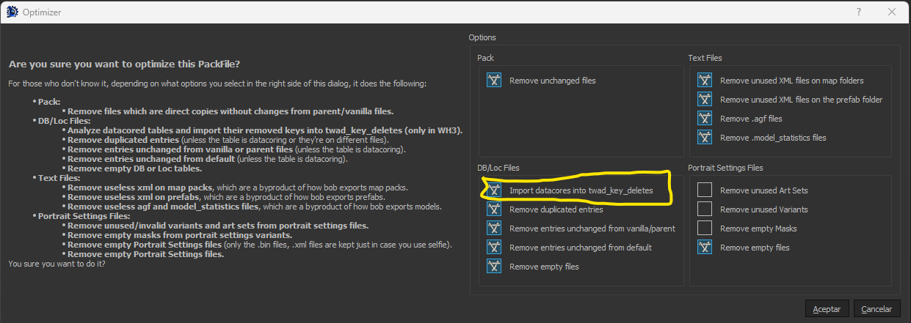
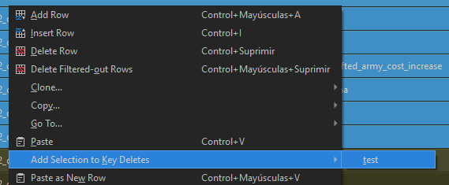

# Datacores And You

### What is a "datacore"?

To explain what a datacore is, first we need to explain how table lines are loaded. Imagine the following table setup:

- **db/whatever_tables/@table**
- **db/whatever_tables/data__**  (this is the vanilla table, may vary in some games)
- **db/whatever_tables/ztable**

When loading ingame, those three tables are kinda merged into one, and when two lines of that merged table have the same key values, only the first line loads.
Meaning:

- **db/whatever_tables/@table**: This contains new lines and lines intended to overwrite vanilla lines. For example, if you just want to change a value from a vanilla line, you put it here and change the value here.
- **db/whatever_tables/data__**: This contains the vanilla data.
- **db/whatever_tables/ztable**: This contains new lines that, in case of conflict, you want overwritten. Like vanilla fixes and things like that.

Now you may notice there's a specific situation I haven't mentioned. What do you do if you want to remove lines from a table? For example, how do you remove an effect from a building? You have only one way: overwrite the entire table in your mod with the line removed. **That's what's called 'Datacoring'**.

### Why is bad?

A simple example: imagine you have this fancy effects table, and you want to remove one of the effects in a submod. You import the table into your submod, edit it, and it works. Until.... the parent mod is updating adding new effects. Now your submodded table doesn't have those new effects, meaning either you update your table with the new effects, or it will cause unintended removal of effects. And what if another submod tries to remove a different effect? Then a highlander situation happens: **there can only be one**.

In summary, datacoring, while useful for a specific situation, reduces the compatibility of the mod, makes the mod way bigger than it needs to be and increases the maintenance burden on the modder. So it should be avoided unless it's really needed. And starting with Warhammer 3, patch 6.3, it should no longer be needed.

### Datacores BEGONE!!!

In Warhammer 3, starting with patch 6.3, RPFM can now create a new table called *twad_key_deletes_tables*. This is a simple `table_name/key` table, and its purpouse is to perform a runtime deletion of keys from tables, replacing the need for datacoring tables. There are three ways to use it:

- ***If you have a mod with datacores***: Go to `Special Stuff/Warhammer 3/Optimize PackFile`, check the `DB & Loc Files/Import datacores into twad_key_deletes` checkbox, and hit `Accept`. This will analyze all your datacores and add the removed entries into a new twad_key_deletes table. After that you can make sure all the relevant entries are there, and then delete the datacores. **It's recommended you rename the new generated table**, because RPFM will overwrite it if you repeat this process again.

- ***If you just want to ignore some lines***: First, create the table like a normal db (right-click the pack, then `Create/Create DB`, select it from the combobox, give it a name and and hit accept). Once the table exist in your pack, ***YOU DO NOT NEED TO EDIT IT MANUALLY***. In fact, due to the way keys are shown in RPFM, specially in multikey tables, if you try to input a key manually in the twad_key_deletes table chances are you write it wrong and you won't notice it until you start the game. Instead, go to the table you want to remove the lines from, select them, right-click, `Add Selection to Key Deletes` and click on your new table. This will automatically add the keys of the selected rows to the twad_key_deletes table you created. Magic!

### But it is gold all that glitters?

Now, while this allows modders to finally get rid of datacores, there are some caveats that one has to take into account:

- The effect ingame is like if we remove a line from the db. This means **if you remove a line that's referenced in another table, chances are your mod's going to crash the game**. Just like if you remove a line from `land_units` in a datacore and don't remove all the references to said unit. Though this time is worse, because RPFM's diagnostics cannot detect this kind of broken reference (yet) and if the game warns you about it in a dialog when it crashes, it may point you to the wrong pack. So if used without the proper though, this can cause more problems than it solves.

- **Load order matters**: Meaning if a mod removes a line, then a lower priority mod adds it back, the line will be removed, then added back.

