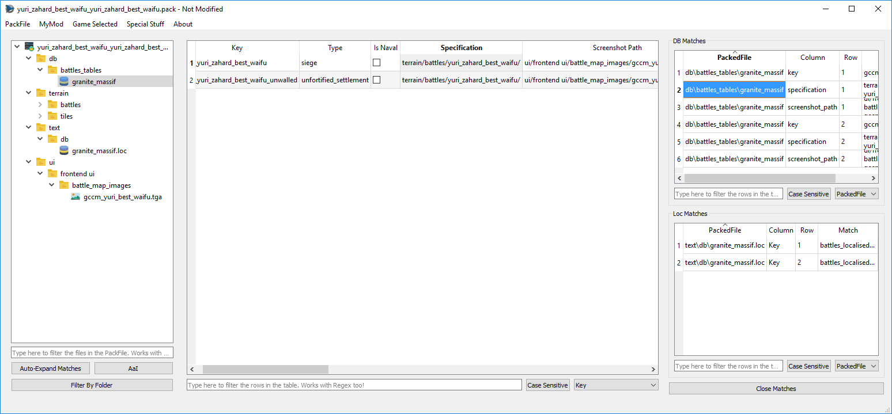

# Global Search

`Global Search` allows you to perform a simple search (accepts Regex) across every DB Table or Loc PackedFile inside your PackFile, providing you with a filterable list of results in the right of the screen. You can use it from the TreeView's Context Menu, or with the shortcut `Ctrl+Shift+F` while the TreeView is focused.

The `Matches` lists on the right of the screen shows every match for your search in **DB Tables** (top table) and **Loc PackedFiles** (bottom table). Both lists **are filterable** (with regex support) and contain the path to the PackedFile, Column, Row, and Matched Text. If you double-click on them, their PackedFile **will be open and the match selected**. Also, these lists are updated when you make changes, so if you, for example, remove a match from a table, that match will be removed on-the-fly from the list.

The only inconvenient is that doing this in PackFiles with an enormous number of tables and a brutal number of matches will cause RPFM to hang a second after each edit.
