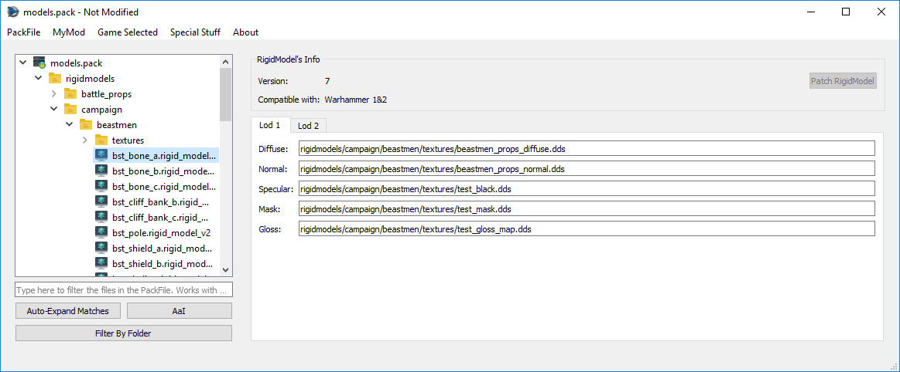

# RigidModel PackedFiles

RigidModels are 3D models used by Total War Games. RPFM allows some limited editing of them. It allows you to **change any of the textures** each model uses and to patch Attila's RigidModels for being loadable in Warhammer games (just the model, it doesn't patch collisions or logic). It doesn't work with all the RigidModels.
