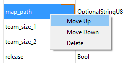
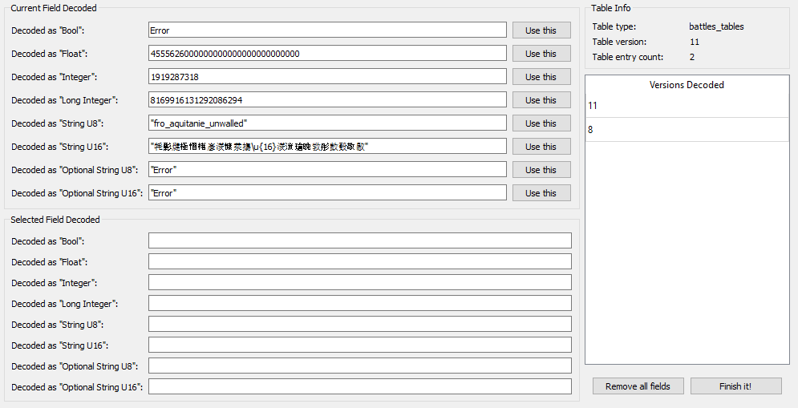

# DB Decoder

RPFM has an integrated database decoder, to speed up a lot the decoding process of the " **structure**" (or " **Definition**") of a table. It can be opened by right-clicking on a table and selecting " **Open/Open with Decoder**". Only works on tables.

Starting by the left we have this:

This is the " **PackedFile's Data**" view. It's similar to a hexadecimal editor, but far less powerful, and it's not editable. In the middle you have "_Raw Hexadecimal Data_", and in the right, you have a "_Decoded_" version of that data. To make it easier to work with it, both scrolling and selection are synchronised between both TextViews. So you can select a byte in the middle view, and it'll get selected in the right one too. The colour code here means:

- **Red** : header of the table. It contains certain info about what's in the table.
- **Yellow** : the part of the table already decoded following the structure from the fields table.
- **Magenta** : the byte where the next field after all the fields from the fields table starts.

For performance reasons, this view is limited to 60 lines, which should be more than enough the decode the first row of almost every table.

Next, to the right, we have this:

This is the " **Fields List**". Here are all the columns this table has, including their title, type, if they are a "_key_" column, their relation with other tables/columns, the decoded data on each field of the first row of the table, and a "Description" field, to add commentaries that'll show up when hovering a cell of that column with the mouse.

If we right-click in any field of the table, we have these three self-explanatory options to help us with the decoding:

And finally, under the table, we have this:

The " **Current Field Decoded**" will show up the field that starts in the magenta byte of the "_PackedFile's Data_" View, decoded in the different types the tables use. His use is simple: check what type makes more sense (for example, in the screenshot, it's evidently a "_StringU8_"), and click the " **Use this**" button in his row. Doing that will add a field of that type to the "Fields List", and it'll update the "_PackedFile's Data_" View to show where the next field starts. Keep doing that until you think you've decoded the complete first row of the table, hit " **Finish It!**" at the right bottom corner, and select the table again. If the decoding is correct, the table will open. And that's how I met your mother you decode a table.

Under " **Current Field Decoded**" we have " **Selected Field Decoded**". It does the same that "_Current Field Decoded_", but from the byte you selected in the "_PackedFile's Data_" View. Just select a byte and it'll try to decode any possible field starting from it. It's for helping decoding complex tables.

To the right, we have a list of data about the table, and the list of versions of that table we have a definition for. If we right-click in one of them, we can load that version (useful to have something to start when a table gets "_updated_" in a patch) or delete it (in case we make a totally disaster and don't want it to be in the schema).

And at the bottom, we have the " **Remove all fields**" and "_Finish It!_" buttons. The first one clears the "_Fields List_" and reset the decoding process. The second one saves the current "_Fields List_" into the game's schema and reloads the schema, so the changes can be used immediately.
